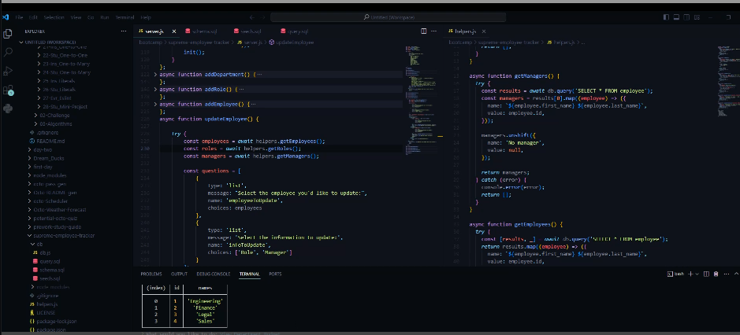

# supreme-employee-tracker

## Description
This Employee Tracker Database CLI, built with Node.js, Inquirer, and MySQL, simplifies company employee database management. Its interactive command-line interface, powered by Inquirer, ensures user-friendly navigation and efficient data handling, streamlining operations for enhanced productivity.

## Table of Contents

- [Installation](#installation)
- [Usage](#usage)
- [Credits](#credits)
- [License](#license)

## Installation and Usage
 1. Confirm that you have [Node.js](https://nodejs.org/en) and [MySQL](https://www.mysql.com/) installed before using this app
 2. Either git clone or download a zip of this repo.\
 3. Navigate to your Command Line Interface to the folder with the code files.
 4. Run `npm i` to install dependencies then run `npm install cli-color`
 5. Navigate your Command Line Interface to the db folder
 6. Enter `mysql -u root -p` and enter your MySQL password once prompted
 7. Run `source db/schema.sql` then if you want to run  `source db/seeds.sql` (this will populate with the database with mockdata so you can see if its running properly) you can confirm if the database is working properly with `source db/query.sql` if its working properly run `source db/schema.sql` again to empty the employee database.
 8. Enter `quit` to exit MySQL
 9. Run `cd ..` to get back to the main/root folder of the project.
 10. Run `node server.js` to start the application

## Demo and 

## Tools
* [MySQL](https://www.mysql.com/)
* [Node.js](https://nodejs.org/en)
* [Cli-color](https://www.npmjs.com/package/cli-color)
## Credits

Cli-color for allowing for colored text for the console.logs and errors

## License

